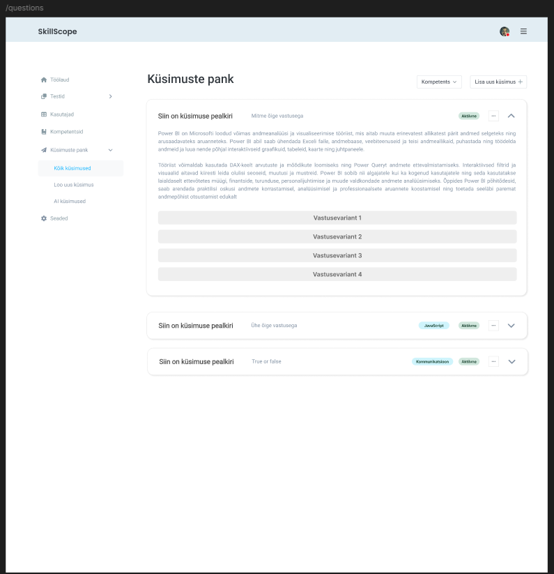

# Küsimuste panga nimekirja päring

**Teenus:** `GET /api/question-bank?competenceId={competenceId}`

**Vaste balsamic mockupis:** vaade "Küsimuste pank" (`/questions`), märkmed failis `docs/balsamic/notes/QuestionBankView-markmed.md` (sektsioon "API märkmed — GET /api/question-bank") (vt lisatud pilt `Kusimuste-panga-nimekirja-paring.png`)



## Sisend

**Query parameeter:**

| Parameeter | Tüüp | Kohustuslik | Kirjeldus |
|---|---|---|---|
| `competenceId` | Integer | Ei | Kompetentsi id (`competence.id`). Kui puudub, tagastatakse kõigi kompetentside küsimused. |

Näited:
- `GET /api/question-bank` — kõik küsimused
- `GET /api/question-bank?competenceId=1` — ainult JavaScripti küsimused

Request body puudub.

## Väljund

**Response (200 OK):** list küsimustest koos kompetentsi, küsimuse tüübi, staatuse ja vastusevariantidega.

DTO: `QuestionBankDto.java` (vastusevariandid eraldi DTO-na, nt `QuestionBankAnswerDto.java`)

```json
[
  {
    "questionId": 2,
    "questionTitle": "Millised järgnevatest on JS primitiivtüübid?",
    "questionDescription": "Vali kõik JavaScripti primitiivtüübid.",
    "questionTypeName": "MULTIPLE_CHOICE",
    "competenceId": 1,
    "competenceName": "JavaScript",
    "competenceLevelName": "Medior",
    "score": 10,
    "questionStatus": "A",
    "answers": [
      {
        "questionAnswerId": 4,
        "answerText": "string",
        "correctChoice": true
      },
      ...
    ]
  },
  ...
]
```

Väljade tähendus:

| Väli | Allikas | Selgitus |
|---|---|---|
| `questionId` | `question.id` | |
| `questionTitle` | `question.title` | |
| `questionDescription` | `question.description` | Kuvatakse lahti klõpsatud kaardil |
| `questionTypeName` | `question_type.name` | `SINGLE_CHOICE`, `MULTIPLE_CHOICE` või `TRUE_FALSE`; frontend tõlgib selle kasutajale loetavaks tekstiks |
| `competenceId` | `question.competence_id` | |
| `competenceName` | `competence.name` | Kuvatakse kompetentsi sildina |
| `competenceLevelName` | `level.name` (läbi `question.competence_level_id` → `competence_level.level_id`) | Kompetentsi tase, nt `Juunior`; kuvatakse lahti klõpsatud kaardil |
| `score` | `question.score` | Küsimuse punktid; kuvatakse lahti klõpsatud kaardil |
| `questionStatus` | `question.status` | `A` (aktiivne) või `I` (mitteaktiivne) |
| `answers[].questionAnswerId` | `question_answer.id` | |
| `answers[].answerText` | `question_answer.answer_text` | |
| `answers[].correctChoice` | `question_answer.correct_choice` | `true` = õige vastus; frontend tõstab selle esile |

## Eesmärk

Teenust kasutab vaade "Küsimuste pank" (`QuestionBankView.vue`, `/questions`), kus admin ja haldur näevad kõiki süsteemis olevaid küsimusi. Vaate avamisel laetakse kõik küsimused, rippmenüüst "Kompetents" valides laetakse küsimused uuesti ainult valitud kompetentsi kohta. Kuna kaardi lahti klõpsamisel näidatakse kirjeldust ja vastusevariante ilma lisapäringuta, peab teenus tagastama kogu info ühe kutsega.

Olemasolev `GET /api/questions?competenceLevelId=` jääb puutumata — see on kasutusel `TestCreateView.vue` vaates ja tagastab ainult `questionId` + `questionTitle`.

## Seotud andmebaasi tabelid

Vt `docs/database/2_create.sql`. Kõik tabelid asuvad skeemas `testi_platvorm`.

### question

Küsimused. Filtreeritakse `competence_id` järgi (kui antud). Staatuse järgi **ei** filtreerita — tagastatakse nii `A` kui `I` staatusega küsimused.

```sql
CREATE TABLE question (
    id serial  NOT NULL,
    competence_id int  NOT NULL,
    competence_level_id int  NOT NULL,
    title varchar(100)  NOT NULL,
    description varchar(1000)  NOT NULL,
    question_type_id int  NOT NULL,
    score int  NOT NULL,
    status char(1)  NOT NULL,
    created_at timestamptz  NOT NULL,
    created_by int  NOT NULL,
    updated_at timestamptz  NOT NULL,
    CONSTRAINT question_pk PRIMARY KEY (id)
);
```

### question_answer

Küsimuste vastusevariandid. Tagastatakse ainult aktiivsed (`status = 'A'`).

```sql
CREATE TABLE question_answer (
    id serial  NOT NULL,
    question_id int  NOT NULL,
    answer_text varchar(255)  NOT NULL,
    correct_choice boolean  NULL,
    correct_position int  NULL,
    paired_answer_id int  NULL,
    status char(1)  NOT NULL,
    CONSTRAINT question_answer_pk PRIMARY KEY (id)
);
```

`correct_position` ja `paired_answer_id` selles teenuses ei kasutata.

### question_type

```sql
CREATE TABLE question_type (
    id serial  NOT NULL,
    name varchar(20)  NOT NULL,
    CONSTRAINT question_type_pk PRIMARY KEY (id)
);
```

### competence

Siit tuleb `competenceName`. Kompetentsi staatuse järgi ei filtreerita.

```sql
CREATE TABLE competence (
    id serial  NOT NULL,
    name varchar(255)  NOT NULL,
    ...
    status char(1)  NOT NULL,
    ...
    CONSTRAINT competence_pk PRIMARY KEY (id)
);
```

### Näidisandmed (`docs/database/3_import.sql`)

Kompetentsid: 1 = JavaScript, 2 = SQL, 3 = Kommunikatsioon, 4 = Vue.js, 5 = Spring Boot, 6 = Git.

Küsimuste tüübid: 1 = `SINGLE_CHOICE`, 2 = `MULTIPLE_CHOICE`, 3 = `TRUE_FALSE`.

Küsimused (kõik `status = 'A'`):

| id | competence_id | title | question_type_id |
|---|---|---|---|
| 1 | 1 | Mis on sulund (closure)? | 1 |
| 2 | 1 | Millised järgnevatest on JS primitiivtüübid? | 2 |
| 3 | 2 | Kas SQL-i võtmesõnad on tõstutundlikud? | 3 |
| 4 | 1 | Mis vahe on let ja const vahel? | 1 |
| 5 | 1 | Mida tagastab typeof null? | 1 |
| 6 | 2 | Milline käsk tagastab tabelist andmeid? | 1 |
| 7 | 2 | Kas WHERE-tingimus filtreerib ridu enne GROUP BY-d? | 3 |
| 8 | 3 | Mis on aktiivne kuulamine? | 1 |
| 9 | 3 | Milline e-kirja pealkiri on kõige selgem? | 1 |

Küsimuse 2 vastusevariandid: 4 = "string" (õige), 5 = "number" (õige), 6 = "massiiv", 7 = "objekt".

Seega `GET /api/question-bank` tagastab 9 küsimust, `?competenceId=1` 4 küsimust (id 1, 2, 4, 5), `?competenceId=2` 3 küsimust.

Teenus **ei puuduta** tabeleid `competence_level`, `test_question` ega `ai_question` / `ai_question_answer` (AI genereeritud ja veel kinnitamata küsimused).

## Veaolukorrad

| Olukord | Status code | Response body |
|---|---|---|
| `competenceId` ei ole täisarv (nt `?competenceId=abc`) | 400 Bad Request | Springi vaikimisi veavastus (`RestExceptionHandler` seda eraldi ei käsitle) |
| Tundmatu `competenceId` (nt 123) | 200 OK | `[]` — viga ei visata |
| Ootamatu serveri viga | 500 Internal Server Error | Springi vaikimisi veavastus |

Kohandatud veateateid (`ApiError` koos `errorCode`-ga) teenus ei tagasta — märkmetes on `Veateated: —`. Rollikontrolli backend ei tee (sama moodi nagu teised GET teenused); vaade on nähtav ainult ADMIN ja MANAGER rollile frontendi menüü kaudu.

## Vastuvõtu kriteeriumid

- [ ] Endpoint `GET /api/question-bank` on olemas, `competenceId` on valikuline `@RequestParam` (`required = false`)
- [ ] Ilma `competenceId`-ta tagastatakse HTTP 200 ja kõik küsimused (näidisandmetega 9 tk)
- [ ] `competenceId=1` korral tagastatakse ainult selle kompetentsi küsimused (näidisandmetega id 1, 2, 4, 5)
- [ ] Tagastatakse nii aktiivsed (`A`) kui mitteaktiivsed (`I`) küsimused, `questionStatus` väljas on küsimuse staatus
- [ ] Iga küsimuse `answers` listis on ainult aktiivsed vastusevariandid (`question_answer.status = 'A'`) koos `correctChoice` väärtusega
- [ ] `questionTypeName` ja `competenceName` tulevad seotud tabelitest (`question_type`, `competence`)
- [ ] Küsimused on järjestatud `questionId` järgi kasvavalt
- [ ] Tundmatu `competenceId` korral tagastatakse HTTP 200 ja tühi list `[]`
- [ ] Olemasolev `GET /api/questions?competenceLevelId=` töötab edasi muutmata kujul
- [ ] Controlleril on `@Operation` ja `@ApiResponse` kirjeldused (Swaggeris nähtavad)
- [ ] Teenusele on kirjutatud automaattestid (vähemalt: kõik küsimused, filtreerimine kompetentsi järgi, tühi tulemus)
